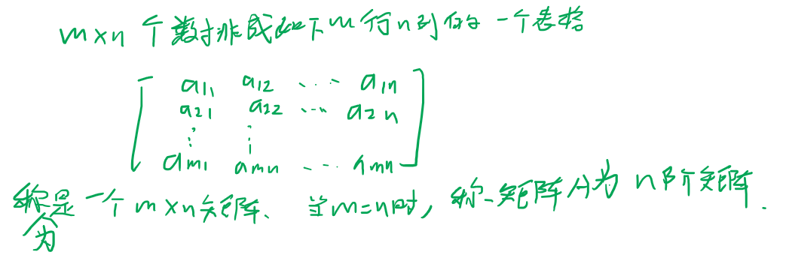
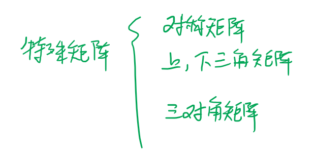
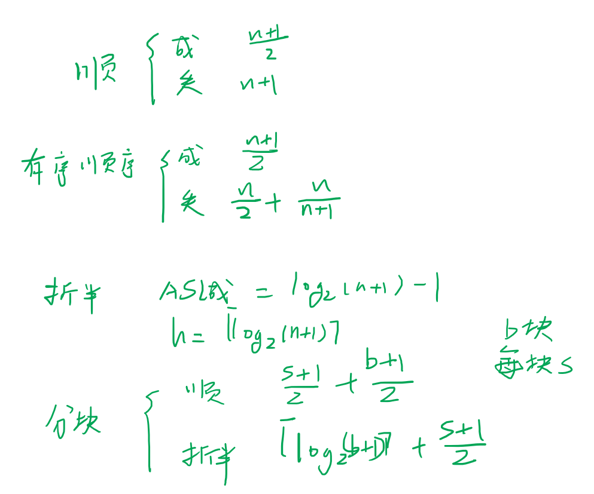
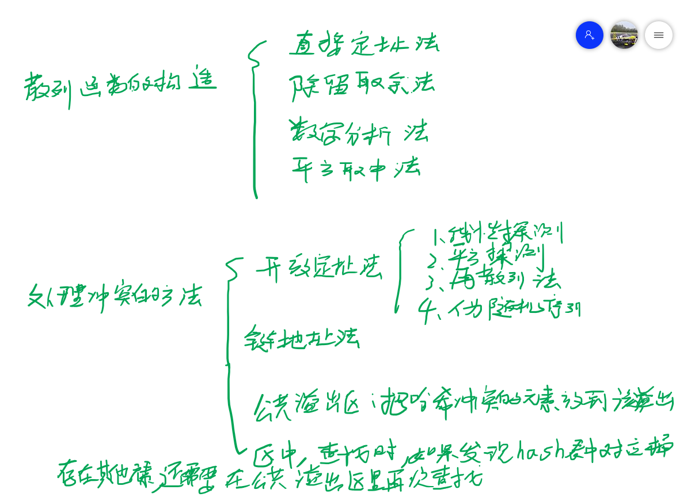
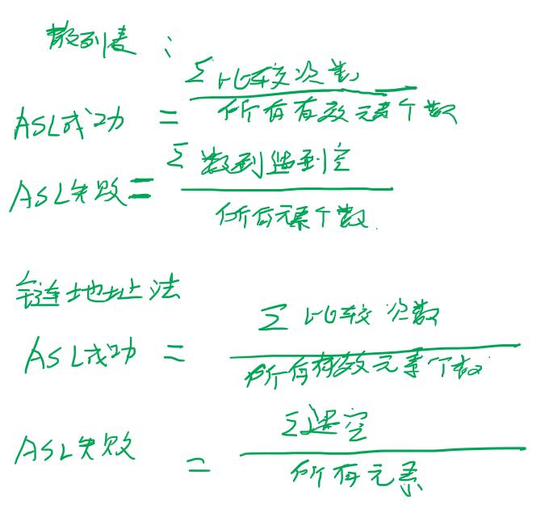
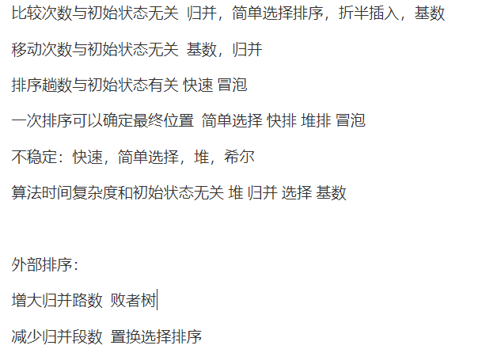

#### 数据

数据是信息的载体，是描述客观事物性质的数、字符以及所有能输入到计算机中并被计算机程序识别和处理的符号的集合。数据是计算机程序加工的原料。

#### 数据元素

数据元素是数据的基本单位，通常作为一个整体进行考虑和处理。一个数据元素可有若干个数据项组成。

#### 数据项

数据项是构成数据元素的不可分割的最下单位

#### 数据对象

数据对象是具有相同性质的数据元素的集合，是数据的一个子集。

#### 数据结构

数据结构是相互之间存在一种或多种特定关系的数据元素的集合。在任何问题中，数据元素都不是孤立存在的，它们之间存在某种关系，这种数据元素之间的关系称为结构。数据结构包括三个方面，逻辑结构，存储结构和数据的运算。

#### 数据的逻辑结构

逻辑结构是指数据元素之间的逻辑关系，即从逻辑关系上描述数据，它与数据 的存储无关，是独立于计算机的。数据的逻辑结构分为线性结构和非线性结构。

#### 数据的物理结构

存储结构是指数据结构在计算机中的表示，也称为物理结构。它包括数据元素的表示和关系的表示。数据的存储结构是用计算机语言实现的逻辑结构，它依赖于计算机语言，数据的存储结构主要有顺序存储，链式存储，索引存储和散列存储。

顺序存储 把逻辑上相邻的元素存储在物理位置上也相邻的存储单元里

链式存储 不要求物理位置的相邻，借助指示元素存储地址的指针表示元素之间的逻辑关系

索引存储 在存储元素信息的同时，添加附加的索引表

散列存储 也称为hash存储，根据节点的关键字通过散列函数直接计算节点的存储地址

#### 数据的运算

施加在数据上的运算包括运算的定义和实现，运算的定义是针对逻辑结构的，指出运算的功能。运算的实现是针对存储结构的，指出运算的具体操作步骤。

#### 数据类型以及抽象数据类型

数据类型是一个值的集合和定义在此集合上一组操作的总称。

抽象数据类型描述了数据的逻辑结构和抽象运算，通常用数据对象，数据关系和基本操作集这样的三元组表示，从而构成一个完整的数据结构的定义。

#### 数据结构的三要素

数据的逻辑结构

数据的存储结构

数据运算

#### 

#### 线性表

线性表是具有相同数据类型的n个数据元素的有限序列，其中n为表长，当n=0时，线性表示一个空表。

#### 顺序表

线性表的顺序存储又称为顺序表。它是用一组地址连续的存储单元依次存储线性表中的数据元素，从而使得逻辑上相邻的两个元素在物理位置上也相邻，第一个元素存储在线性表的起始位置，第i个元素的存储位置后面紧接着存储的是第i+1个元素，称i为元素ai在线性表中 的位序。因此，线性表的特点是元素的逻辑顺序与其物理顺序相同。

#### 链式表

链式存储线性表时，不需要使用地址连续的存储单元，即不要求逻辑上相邻的元素在物理位置上也相邻，它通过指针建立起数据元素之间的关系。

#### 栈

栈是只允许在一端进行插入或删除操作的线性表，首先栈是一种线性表，但是限定这种线性表只能在某一段进行插入和删除。

#### 队列

队列是一种操作受限的线性表，之允许在表的一段进行插入，而在表的另外一段进行删除。

#### 头指针和头节点

无论带不带头节点，头指针始终指向链表的第一个节点

头节点是带头结点单链表的第一个节点，通常不存储有效元素

#### 头节点的好处

1.由于第一个数据节点的位置被存放在头节点的指针域中，所以在链表的第一个位置上的操作和在表的其他位置上的操作一致，不需要进行特殊处理。

2.无论链表是否为空，其头指针都是指向头节点的非空指针，因此空表和非空表的处理得到了统一。

#### 度为2的树和二叉树的区别是什么？

1、度不同

度为2的树要求每个节点最多只能有两棵子树，并且至少有一个节点有两棵子树。二叉树的要求是度不超过2，节点最多有两个叉，可以是1或者0。

在任意一棵二叉树中，叶子结点总是比度为2的结点多一个。

2、分支不同

度为2的树有两个分支，但分支没有左右之分；
一棵二叉树也有两个分支，但有左右之分，左右子树的次序不能随意颠倒。

3、次序不同

度为2的树从形式上看与二叉树很相似，但它的子树是无序的，而二叉树是有序的。即，在一般树中若某结点只有一个孩子，就无需区分其左右次序，而在二叉树中即使是一个孩子也有左右之分

#### 评价算法？

正确性：算法应该能够正确的求解问题

可读性：算法具有良好的可读性，帮助人们理解

健壮性：输入非法数据时，算法能够做出适当的反应或者调整，而不会产生莫名其妙的输出结果

效率和低的存储量需求：效率是指算法的执行时间，存储量需求是指算法执行过程中所需要的最大存储空间，这两者都与问题的规模有关系。

#### 算法

算法是对特定问题求解步骤的一种描述，它是指令的有限序列，其中每一条指令表示一个或多个操作。

#### 算法的特性

1.有穷性 一个算法必须总在执行有穷步之后结束，且每一步都可在又穷时间完成。

2.确定性 算法中每条指令必须有确切的含义，对于相同的输入只能得到相同的输出。

3.可行性 算法中描述的操作都可以通过已经实现的基本运算执行有限次实现。

4.输入  一个算法有零个或多个输入，这些输入取自于某个特定的对象的集合。

5.输出 一个算法有一个或多个输出，这些输出是与输入有着某种特定关系的量。

#### 时间复杂度

一个语句的频度是指该语句在算法中被重复执行的次数。算法中所有语句的频度之和记为T(n)，它是该算法问题规模n的函数，时间复杂度主要分析T(n)的数量级。算法中的基本运算（最深层循环内的语句）的频度与T(n)同数量级，所以通常采用算法中基本运算的频度f(n)来分析算法的时间复杂度。因此，算法的时间复杂度即为T(n) = O(f(n))，上式中O的含义是T(n)的数量级，其严格的数学定义是：若T(n)和f(n)是定义在正整数集合上的两个函数，则存在正常数C和n0，使得当n>=n0时，都满足0<=T(n)<=Cf(n)

#### 空间复杂度

算法的空间复杂度S(n)定义为该算法所耗费的存储空间，它是问题规模n的函数。记为S(n) =(g(n))

一个程序在执行时除需要存储空间来存放本身所用的指令，常数、变量和输入数据外，还需要一些对数据进行操作的工作单元饥和存储一些为实现计算所需信息的辅助单元。若输入数据所占的空间只取决于问题本身，和算法无关，则之分析除输入和程序之外的存储空间。

算法原地工作是指算法所需的辅助空间为常量，即O(1).

#### 时空权衡原则

在解决问题的过程中，很难保证时间和空间的某一个达到最优，只能尽可能的优化时间，达到时空权衡。算法设计中的时空权衡一般是用空间换取时间. 一般有两种手段输入增强和预构造。

输入增强：对部分输入或者全部输入做预处理，获得额外的信息进行存储，以加速后面问题的求解。简单来说，输入增强就是我们得到输入的是时候，不仅仅只是得到了输入，而且还有对这个输入作一番考察和估计，获取其中有用的信息进行存储，方便后边程序进行简化计算，代表有:bm算法，kmp算法

预构造：使用额外的空间来实现更快和更方便的数据存储，代表有散列表和b树索引

动态规划：基于空间换取时间的一种策略。

#### 算法的渐进性分析方法

算法的渐进分析是指定义在其运行时性能的数学边界，使用渐进分析，我们可以很好的得到算法的最佳情况，平均情况和最坏情况。当算法问题的规模很小的时候，基本上在任何一台机器上都会以很快的速度计算出来，只有在问题规模较大的时候分析算法的效率才显得有意义。因此我们要研究算法的**渐进**效率，也就是关心问题的输入规模趋向无穷大时，算法的运行时间是如何增长的。

#### 矩阵

#### 压缩存储：

指的是为多个值相同的元素只分配一个存储空间，对零元素不分配存储空间。其目的是为节省存储空间。

#### 特殊矩阵：

指的是具有许多相同矩阵元素或零元素，并且这些相同的矩阵元素或零元素的分布有一定规律性的矩阵。常见的特殊矩阵有 对称矩阵，上下三角矩阵，三对角矩阵

#### 串：

串是由零个或者多个字符组成的有限序列。

#### 串的模式匹配：

子串的定位操作称为串的模式匹配，他是求子串子在主串中的位置。

#### 空串：

不包含任何字符的串称为空串。

#### 空格串：

有一个或者多个空格字符组成的串。

#### 广义表：

广义表是线性表的推广，广义表定义为N>=0个元素a1,a2,....,an的有限序列。其中ai或者是原子项，或者是一个广义表。通常记为Ls = (a1,a2,....,an)。Ls为广义表的名字，n是他的深度。若ai是广义表，则称它为Ls的子表。

深度

长度

getHead 得到一个元素

getTail 得到一个广义表

#### 森林

若干棵互不相交的树的集合。

#### 树

树是n(n>=0)个节点的有限集合，当n=0时称为空树。任意一棵非空树中满足：

1.有且仅有一个特定的称为根的节点

2.当n>1时，其余节点可分为m（m>0)个互不香蕉的有限集T1 T2 ... Tm，其中每个集合本身又是一棵树，并且称为根的子树。

#### 二叉树

二叉树是n个节点的有限集合：

1.或者为空二叉树，n=0

2.或者有一个根节点和两个互不相交的被称为根的左子树和右子树组成。左子树和右子树又分别是一棵二叉树。

#### 完全二叉树

高度为h，有n个节点的二叉树，当且仅当其每个节点都与高度为h的满二叉树中编号为1-n的节点一一对应时，称为完全二叉树。

#### 平衡二叉树

或者是一棵空树

或者是具有下列性质的二叉树，它的左子树和右子树都是平衡二叉树，且左子树和右子树的高度差的绝对值不超过1。

#### 线索二叉树

对一棵二叉树中所有节点的空指针域按照某种遍历方式加线索的过程叫做线索化，被线索化的二叉树称为线索二叉树。

#### 二叉搜索树

1.要么二叉树查找树是一棵空树。

2.要么二叉树查找树是由根节点，左子树和右子树组成，其中左子树和右子树都是二叉查找树，且左子树上所有节点的数据域均小于根节点的数据域，右子树上的所有节点的数据域大于根节点的数据域。

#### 满二叉树

一棵高度为h，且含有2^h - 1个节点的二叉树称为满二叉树，即树中的每层都含有最多的节点。

#### 并查集

需要将n个不同的元素划分称一组互不相交的集合。开始时，每个元素自己成一个单元素集合，然后按照一定的顺序或问题给定的条件和要求将属于同一组元素所在的集合合并，最后统计集合的个数往往就是问题的解。在这个过程中反复用到查询某个元素数与哪个集合的运算。两个不同集合合并的运算，适合描述这类问题的抽象数据结构类型称为并查集。

#### 哈夫曼树

从树的根到任意节点的路劲长度与该该节点上权值的乘积，称为该节点的带权路径长度。树中所有叶节点的带权路劲长度之和称为该树的带权路径长度。

在含有n个带权叶节点的二叉树中，其中带权路径长度WPL最小的二叉树称为哈夫曼树。

#### 构造哈夫曼树的过程

（1）将这n个顶点分别作为n棵仅含有一个节点的二叉树，构成森林F.

（2）构造一个新节点，从F中选取两棵根节点权值最小的树作为新节点的左右子树，并且将新节点的权值置为左右子树根节点的权值之和。

（3）从F中删除刚才选出的两棵数，同时将新得到的树加入到F

（4）重复上述步骤(2)(3)，直至F中只剩下一棵树为止。

#### 哈夫曼编码：

哈夫曼编码是可变长编码的一种，可变长编码要比固定长度编码好的多，其特点是对频率高的字符赋以段短编码，对于频率低的字符赋以段长编码，从而使得平均编码长度变短，起到数据压缩的效果。

#### 哈夫曼编码过程：

首先将每个出现的字符作为一个独立的节点，节点权值是该字符的频度，构造出对应的哈夫曼树。显然，所有字符节点都出现在叶子节点中。我们可以将字符的编码解释为从根至该字符路径上边标记的序列，其中标记为0的表示“转向左孩子”，标为1的表示“转向右孩子”。

#### 堆

堆通常是一个可以被看作一棵树的数组对象，堆总是满足下列性质：

1.堆中任意一个节点的值都大于（或者)左右节点的值。

2.堆是一棵完全二叉树

#### 图：

图G是由顶点集合V和边集E组成，记G = (V, E)， 其中V(G)表示图G中顶点的有限非空集，E(G)表示图G中顶点之间的关系集合。

#### dfs

首先访问图中的某一起始顶点v,然后由v出发，访问与v邻接并且未被访问的任何一个顶点w1,再访问与w1邻接并且违背访问的任一顶点w2....重复上述过程，当不能再继向下访问时，依次退回到最近被访问的顶点，若他还有邻接顶点未被访问，则从该点开始继续上述搜索过程，直至图中的所有顶点均被访问过为止。

#### bfs

首先访问起始顶点v,接着由v出发，依次访问v的各个未访问过的邻接点w1,w2,...wi,然后依次访问w1,w2,....,wi的所有未被访问过的邻接顶点，再从这些访问过的顶点出发，访问他们所有未被访问过的邻接顶点，直至图中所有顶点都被访问过为止。若此时图中尚有顶点未被访问，则选中图中一个未曾被访问的顶点作为起始点，重复上述过程，直至图中所有顶点都被访问到为止。

#### 关键路径：

AOE网中的最长路径称为关键路径，而把关键路径上的活动称为关键活动，显然关键活动会影响整个工程的进度。

#### 最短路径：

当图是带权图，把从一个顶点v0到图中其余任意一个顶点vi的一条路径(可能不止一条)所经过边上的权值之和，定义为该路径的带权路径长度，把带权路径长度最短的那条路径称为最短路径。

#### 最小生成树：

对于一个带权连通无向图G = (V,E)，生成树不同，每棵树的权也可能不同。设R为G的所有生成树的集合，若T为R中边的权值之和最小的那棵生成树，则T此称为G的最小生成树。

#### 拓扑排序：

拓扑排序是将有向无环图G的所有顶点排成一个线性序列，使得对图G中的任意两个顶点u,v, 如果存在边u->v，那么在序列中u一定在v的前面，这个序列又称为拓扑序列。

#### floyd算法：

A path o(n^3) i!=j  i!=k j!=k

#### 关键路径：

把所有从源点到汇点的路径中，具有最大路径长度的路径称为关键路径，而把关键路径上的活动称为关键活动。

#### 拓扑排序的步骤？

（1）从AOV网中选择一个没有前驱的顶点并输出。

（2）从网中删除该顶点和所有以它为起点的有向边。

（3）重复(1)和(2)的直到当前的AOV网为空或者当前网中不存在无前驱的顶点位置。后一种说明图中必有环。

#### AOE：

在带权有向图中，以顶点表示时间，以有向边表示活动，以边上的权值表示完成该活动的开销，称为边表示活动的网络，简称AOE网络。

#### AOV网：

若用DAG图表示一个工程，其顶点表示活动，用有向边<Vi,Vj>表示活动Vi必须先于活动Vj进行的这样一种关系，则讲这种有向图称为顶点表示活动的网络，记为AOV网。

#### 完全图

对于无向图，|E|的取值范围是0，n(n-1)/2，有n(n-1)/2条边的无向图称为完全图，在完全图中任意两个顶点之间的都存在边。对于有向图，|E|的取值范围是0，n(n-1)，有n(n-1)条弧的有向图称为有向完全图，在完全有向图中中任意两个顶点之间都存在方向相反的两条弧。

连通图

简单路径

#### 子图

设有两个图G = (V, E)和G' = (V', E')， 若V‘是V的子集，且E'是E的子集。则称G'是G的子图。

#### 多重图

若图G中某两个节点之间的边数多与1条，又允许顶点通过同一条边和自己关联，则G为多重图。

#### 简单图

一个图满足以下条件，称为简单图：

1.不存在重复边

2.不存在自环边

#### 有向图

若E是有向边的有限集合时，则图G是有向图

#### 无向图

若E是无向边的有限集合时，则图G是无向图。

无环图

图和二叉树、树、森林之间的异同点

#### 查找：

在数据集合寻找满足某种条件的数据元素的过程称为查找。查找的结果一般分为两种，1.查找成功，即在数据集合中找到了满足条件的数据元素；2.查找失败。

#### 哈希表：

根据关键字而直接进行访问的数据结构。

#### 哈希表的删除：

在散列表中删除一个记录，在链地址法的处理哈希冲突的情况下可以直接进行物理删除。但是在开放定址法情况下，不能物理的删除，只能做删除标记。因为该地址可能是该记录的同义词查找路径上的地址，物理的删除就中断了查找路径，因为遇到空地址就认为是查找失败。

#### 哈希冲突：

散列函数可能会把两个或者两个以上不同的关键字映射到同一个地址，称这种情况为冲突。这些发生冲突的不同关键字称为同义词。

#### 排序的定义：

排序，就是重新排列表中的元素，使表中的元素满足按关键字有序的过程。为了能够查找方便，通常希望计算机中的表是按关键字有序的。排序的确切定义如下：

输入：n个记录R1 R2 ... Rn， 对应的关键字是k1 k2 .... kn

输出：输入序列的一个重排R1' R2' .... Rn', 使得 k1' <= k2' <= ..... <= kn'

#### 稳定性的定义：

若待排序表中有两个元素Ri和Rj，其对应的关键字ki=kj，且在排序前Ri在Rj的前面，若使用某一排序算法之后，Ri任然在Rj的前面，则称这个排序算法是稳定的。若相对位置发生了变化，则排序算法是稳定的排序算法。

#### 外排序和内排序的区别：

在排序的过程中，根据数据元素是否完全在内存中，可以将排序算法分成两类：

1.内部排序，是指排序期间全部元素全部放在内存中的排序

2.外部排序，是指在排序期间元素无法全部同时存放在内存中，必须在排序的过程中根据要求不断在内存和外存之间移动的排序。

#### k路归并排序：

对于外部排序算法来讲，影响整体排序效率的因素主要取决于读写磁盘的次数，即访问磁盘的次数越多，算法花费的时间就越多，效率就越低。而对于同一个文件来说，对其进行外部排序时访问外存的次数同归并的次数成正比，及归并操作的次数越多，访问外存的次数就越多.

为了提高外部排序的效率,降低归并次数,所以引入了k路归并排序。